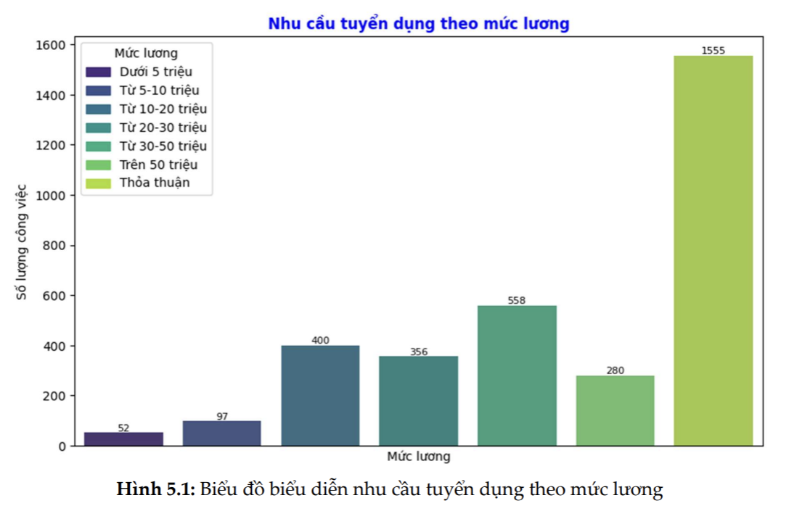
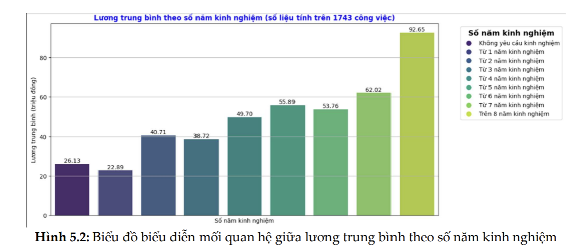
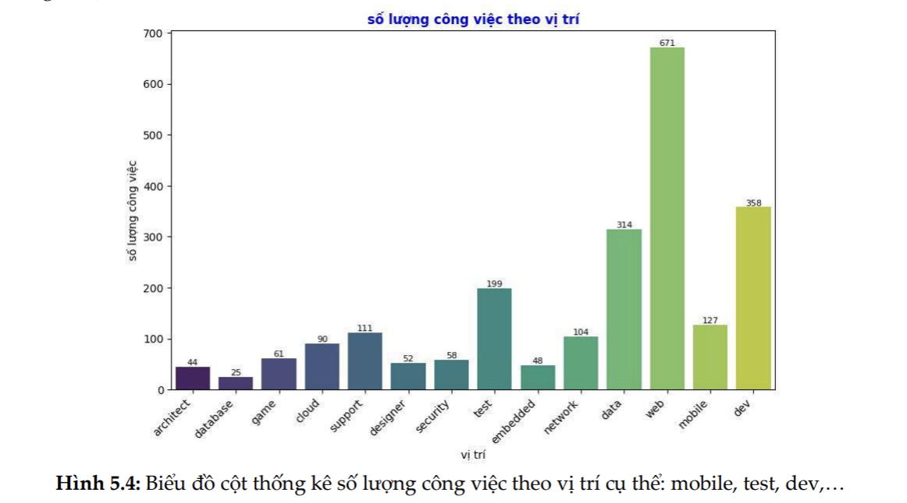
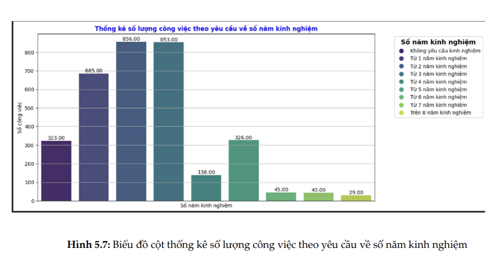

# Vietnamese IT Job Market Analysis

This project involves scraping data on IT jobs from five popular job websites in Vietnam. The collected data is analyzed to provide insights into the IT job market, including common requirements and trends. Specifically, the analysis addresses the following questions:

- **What is the typical salary range for IT jobs?**
- **How does the number of years of experience correlate with salary?**
- **What are the common IT positions, and how many job openings are available for each?**
- **What level of experience is typically required for IT roles?**
- **What are the common job benefits offered?**
- **What specific skills are required for each IT job type, and what are the common job descriptions?**

## Data Attributes

The dataset includes job postings with the following information:
- **Salary**
- **Work Mode** (e.g., remote, onsite)
- **Location**
- **Job Category** (e.g., cloud, frontend, backend, AI)
- **Years of Experience Required**
- **Skills Required**
- **Job Description**
- **Job Benefits**

## Analysis Results

### What is the typical salary range for IT jobs?

The graph shows that most job postings do not specify a fixed salary, noting instead that the salary is negotiable. The most common salary range is between 10 million and 30 million VND, which aligns with our expectations (considering both the 10-20 and 20-30 million ranges). However, it's surprising to find that the number of jobs offering a salary of 30 to 50 million VND is higher than for any other range. This contradicts the expectation that lower-salary jobs should be more prevalent.

### How does the number of years of experience correlate with salary?

There is a positive correlation between years of experience and salary. An IT specialist with 4 to 6 years of experience can expect a salary between 50 and 56 million VND, while those with 7 years of experience earn an average of 62 million VND. Professionals with more than 8 years of experience can earn an average of over 90 million VND.

### What are the common IT positions, and how many job openings are available for each type?

The most common IT positions are related to software development, including web developers, testers, software developers, and mobile developers. Data-related positions (e.g., data engineers, data scientists, data analysts) have the second-highest number of job openings, reflecting the growing demand in this area. Other IT positions have job postings ranging from 25 to over 100.

### What level of experience is typically required for IT roles?

Most job postings require 2 to 3 years of experience, followed by positions that need at least one year of experience.

### What are the common job benefits offered?

The five most common job benefits are birthday presents, insurance packages, skill training, company trips, team building activities, and an additional monthly salary bonus.

### What specific skills are required for each IT job type, and what are the common job descriptions?

Below is a table listing information for five common IT positions: Web Developer, Data-related roles, UX Designer, Database-related roles, and Cloud Engineer. The table includes the 10 most commonly mentioned skills and job requirements.

| Position    | Common skill requirements                                             | Common job  requirements                                                        |
|----------|--------------------------------------------------------------|------------------------------------------------------------------------------|
| architect | "Software Architect", "Java", "Cloud", "AWS", "Python", "DevOps", "C++", "Aws", "Solution Architecture", "Golang" | "System application performance tuning", "Infrastructure Architecture and Design", "Experienced IT Team Management", "Effective Collaboration Skills", "English proficiency in client presentations", "Agile Methodologies with Kanban", "OOP Design Patterns", "Java EE Server Architectures", "Financial Banking Experience", "Recognition of Contributions", "SQL Server and Database" |
| cloud     | "DevOps", "Cloud", "AWS", "Linux", "Python", "Azure", "Java", "SQL", "Networking", "CI/CD" | "Security Best Practices and Ethical Hacking", "DevOps Methodology Fundamentals", "Windows and Linux Operating Systems", "Virtualization and Hypervisors", "Strong Troubleshooting Skills", "Experienced CI/CD with Jenkins Git", "Microservices Architecture Experience", "Configuration Management Automation Tools", "Networking and Routing Protocols", "AWS SysOps Architect Certification", "CICD Tools Deployment", "Database Technology Experience" |

